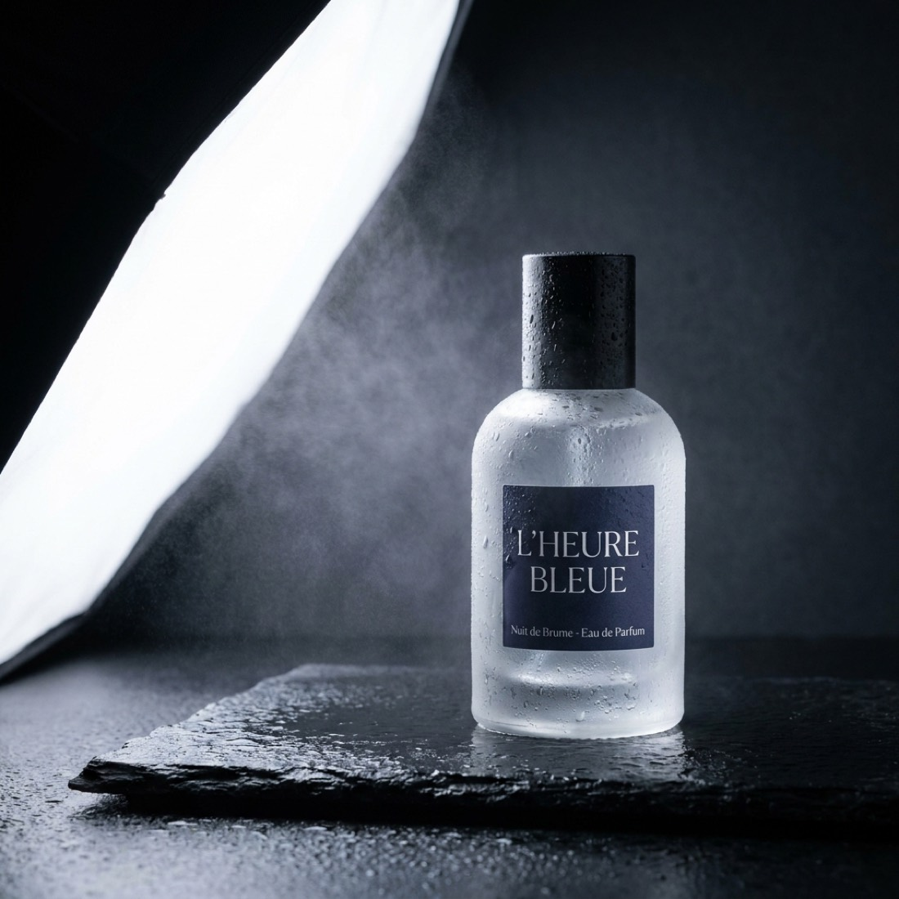
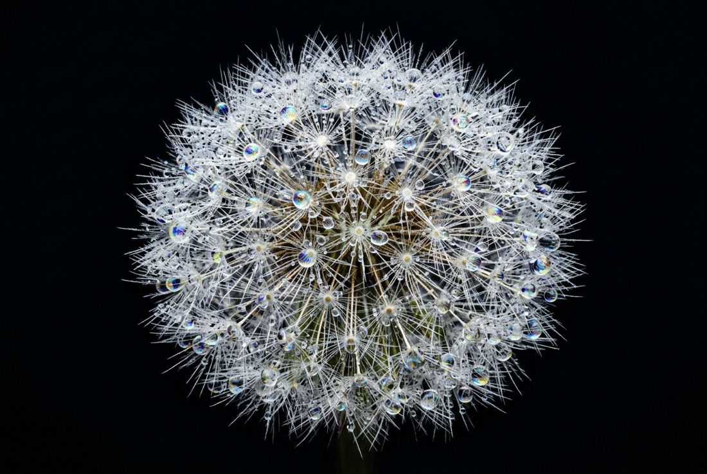
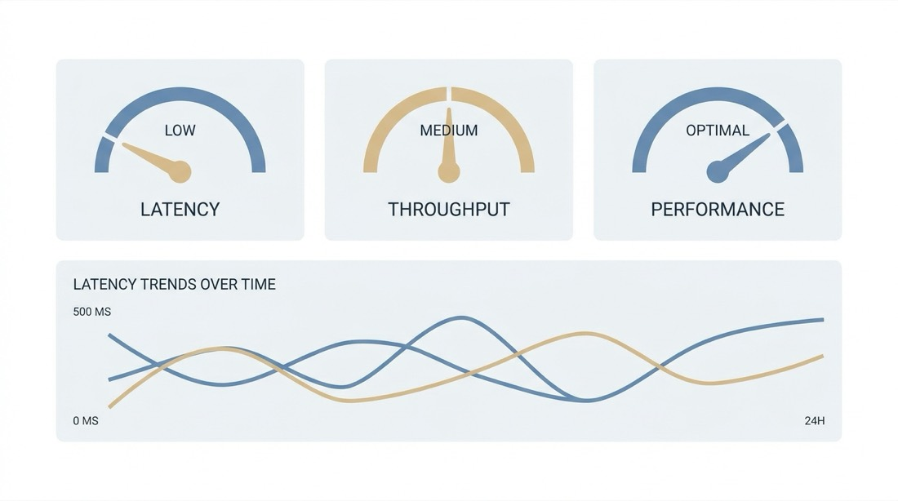

# Nano Banana Pro Prompts — 8 Tested Recipes With Outputs

Eight **Nano Banana Pro prompts** run end to end through the API, published with the render each one produced, the aspect ratio and the cost the task reported. Copy a recipe, keep the structure, swap the subject.

**Attributed entry points:** [Open Nano Banana Pro on APIMart](https://go.apimart.ai/k-cf5994) · [Current pricing](https://go.apimart.ai/k-17949c) · [Get an API key](https://go.apimart.ai/k-f06c4a)

- Model: `gemini-3-pro-image-preview`
- Recipes: **8** (machine-readable in [`data/prompts.json`](data/prompts.json), table in [`PROMPTS.md`](PROMPTS.md))
- Measured cost of the whole set: **$0.24**

## What separates a usable recipe from a wasted call

Three rules held up across every render in this set:

1. **Name the material, not the adjective.** "Frosted glass", "matte ceramic", "layered paper" steer rendering far more
   than "beautiful" or "high quality".
2. **Set the light explicitly.** "Single softbox from the left", "golden hour backlight", "focus-stacked studio light"
   remove the guesswork the model would otherwise do for you.
3. **Pin the framing.** Ratio plus lens language (`85mm`, `24mm`, `macro`, overhead flat lay) decides whether the output
   drops into a layout unchanged.

## Prompt structure cheat-sheet

| Slot | What to write | Example |
| --- | --- | --- |
| Subject | one concrete object or person, with material | *frosted glass perfume bottle* |
| Light | direction + quality | *single softbox from the left* |
| Framing | ratio + lens or distance | *3:4, medium format look* |
| Setting | surface, backdrop, environment | *wet black stone slab* |
| Finish | render or film character | *commercial product photography* |

## The gallery

Each row is one API call: output, category, ratio, reported cost and the exact prompt.

| Output | Recipe | Ratio | Cost | Prompt |
| --- | --- | --- | --- | --- |
|  | Product / e-commerce | 1:1 | $0.03 | `Studio hero shot of a frosted glass perfume bottle on a wet black stone slab, single softbox from the left, faint mist, deep charcoal background, crisp label text, commercial product photography` |
|  | Cinematic still | 16:9 | $0.03 | `Rain soaked Kyoto alley at night, paper lantern reflections on wet stone, a lone figure with a transparent umbrella walking away, cinematic 35mm still, shallow depth of field, film grain` |
|  | Food photography | 4:3 | $0.03 | `Overhead flat lay of a spicy miso ramen bowl with soft boiled egg, nori and scallions, dark ceramic table, chopsticks resting on the rim, natural window light, editorial food photography` |
|  | Architecture | 16:9 | $0.03 | `Minimalist concrete villa on a cliff at dusk, warm interior light, infinity pool reflecting a violet sky, architectural photography, 24mm perspective, ultra sharp` |
|  | Illustration | 1:1 | $0.03 | `Layered paper cut illustration of a mountain lake at sunrise, five depth layers, soft pastel palette, subtle drop shadows, art print composition, clean vector edges` |
|  | Fashion portrait | 3:4 | $0.03 | `Editorial fashion portrait of a model in an oversized ivory wool coat, seamless light grey studio backdrop, crisp high key lighting, medium format detail, calm expression` |
|  | Macro nature | 3:2 | $0.03 | `Macro photograph of a dew covered dandelion seed head against deep black background, focus stacked detail, iridescent droplets, studio lighting` |
|  | Design / UI | 16:9 | $0.03 | `Flat vector dashboard panel showing three gauge dials and abstract latency curves, muted blue and sand palette, generous white space, crisp geometric cards, no placeholder text` |

## Run a recipe yourself

```bash
export APIMART_API_KEY=...
python examples/run_recipes.py --dry-run                 # list the recipes, no network
python examples/run_recipes.py --limit 2                 # generate two of them
python examples/run_recipes.py --category "Food"         # filter by category
```

```bash
curl --request POST --url https://api.apimart.ai/v1/images/generations \
  --header "Authorization: Bearer $APIMART_API_KEY" --header 'Content-Type: application/json' \
  -d '{"model":"gemini-3-pro-image-preview","prompt":"<paste a prompt>","size":"1:1","resolution":"1K","n":1}'
```

Result links expire, so store the outputs; the completed task carries `cost` for reconciliation.

## FAQ

**Are these prompts free to reuse?**

Yes — the prompt text in this repository is MIT licensed. The generated images and any third-party marks they contain remain your responsibility, and you should check the model vendor's terms before publishing commercial work.

**Why do the recipes use different aspect ratios?**

Because ratio is a layout decision, not a style one: 1:1 for catalogue and icons, 16:9 for hero and video thumbnails, 3:4 or 2:3 for portraits and print. Pinning it up front avoids cropping later.

**How much does one recipe cost to run?**

The cost column is what the completed task reported. On the per-image route the price depends on the resolution tier, so 1K recipes are the cheap ones and 4K costs more per image.

**Can I use a recipe as a template for another subject?**

That is the point. Keep the structure (subject + light + framing + setting + finish) and replace the subject; changing everything at once makes it impossible to tell which phrase moved the output.

## Related searches

- `nano banana pro prompts`
- `nano banana pro prompt examples`
- `nano banana pro api`
- `image prompt structure`
- `ai image prompts 2026`
- `product photography prompts`
- `cinematic image prompts`

## Attributed links (how this repository is measured)

| Purpose | Attributed link | Target |
| --- | --- | --- |
| Open Nano Banana Pro on APIMart | <https://go.apimart.ai/k-cf5994> | model page |
| Current pricing page | <https://go.apimart.ai/k-17949c> | `apimart.ai/pricing` |
| Get an API key | <https://go.apimart.ai/k-f06c4a> | `apimart.ai/keys` |

Outbound APIMart links are minted through the promo link API; hand-made tracking parameters are rejected by
`tools/check_links.py` in CI.

## Disclosure

Nano Banana Pro is a third-party model served through APIMart. This repository publishes prompts, real outputs and
measured costs; it does not claim official status for any vendor, and model names and documentation belong to their
owners.

## Repository map

```text
README.md              gallery, prompt structure and FAQ
PROMPTS.md             every recipe in one table
data/prompts.json      machine-readable recipes with measured cost
examples/run_recipes.py  batch runner (dry-run safe for CI)
tools/check_links.py   attribution guard
assets/                real renders (JPEG, resized for the README)
.github/workflows/     validation
```

## License

MIT — see [LICENSE](LICENSE).
